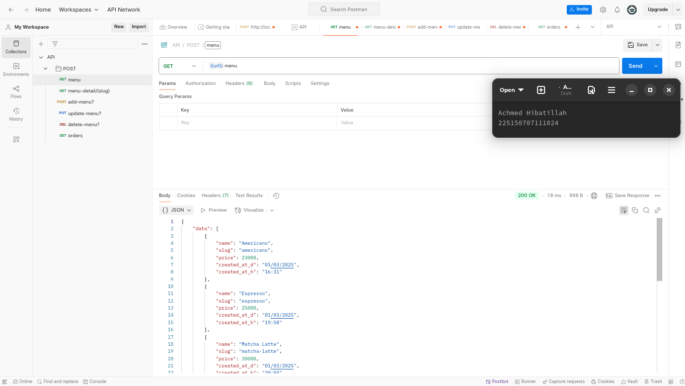

# TUGAS LARAVEL API
#### Achmed Hibatillah
#### 225150707111024
 
Penggunaan API dalam web laravel dengan method:

- GET 
- POST
- PUT
- DELETE

## Deskripsi

Saya menggunakan aplikasi reservin yang saya buat untuk sistem transaksi produk FnB. Dalam kasus ini, saya menggunakan tabel **products**, **orders**, dan **orders_detail**. Berikut method yang saya uji di **Postman**:

### 1. GET: [http://127.0.0.1:8000/api/menu](http://127.0.0.1:8000/api/menu)
Mengembalikan nilai seluruh data dalam tabel products yang tersedia di database.

### 2. GET [http://127.0.0.1:8000/api/menu-detail{slug}](http://127.0.0.1:8000/api/menu-detail/{slug})
Mengembalikan satu baris data dalam tabel products berdasarkan kolom _product_slug_.
### 3. POST [http://127.0.0.1:8000/api/add-menu?product_name=value&product_price=value](http://127.0.0.1:8000/api/add-menu?product_name=value&product_price=value)
Menambah satu baris data dalam tabel products.
### 4. PUT [http://127.0.0.1:8000/api/update-menu?product_id=value&product_name=value&product_price=value](http://127.0.0.1:8000/api/update-menu?product_id=value&product_name=value&product_price=value)
Mengubah satu baris data dalam tabel products berdasarkan kolom _product_id_.
### 5. DELETE: [http://127.0.0.1:8000/api/delete-menu?product_id=66853076](http://127.0.0.1:8000/api/delete-menu?product_id=66853076)
Menghapus satu data dalam tabel products berdasarkan kolom _product_id_.
### 6. GET: [http://127.0.0.1:8000/api/orders](http://127.0.0.1:8000/api/orders)
Mengembalikan nilai seluruh data dalam tabel **products**, **orders**, dan **orders_detail** yang tersedia di database.